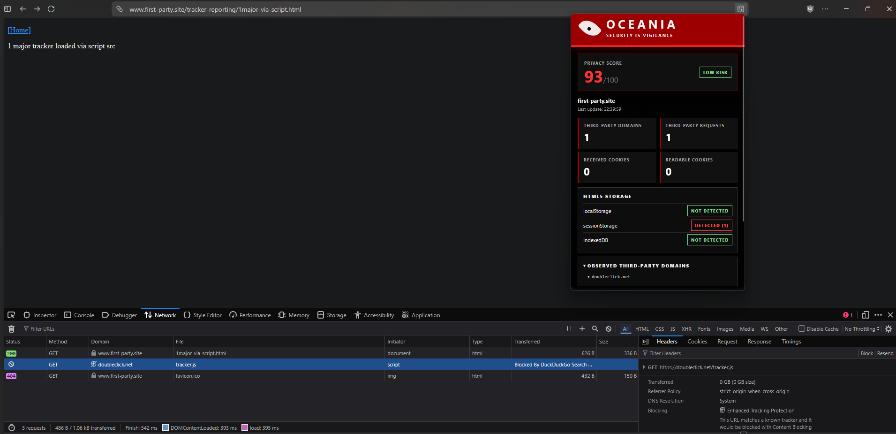
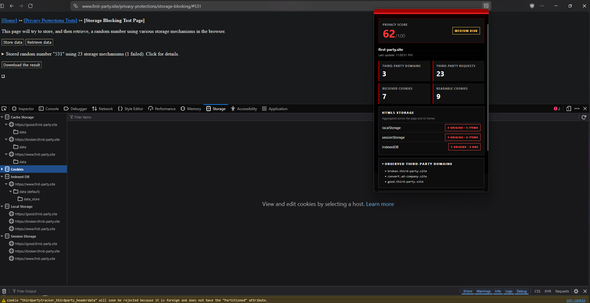
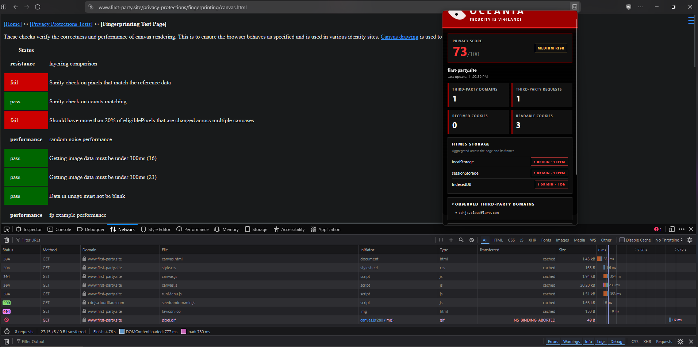
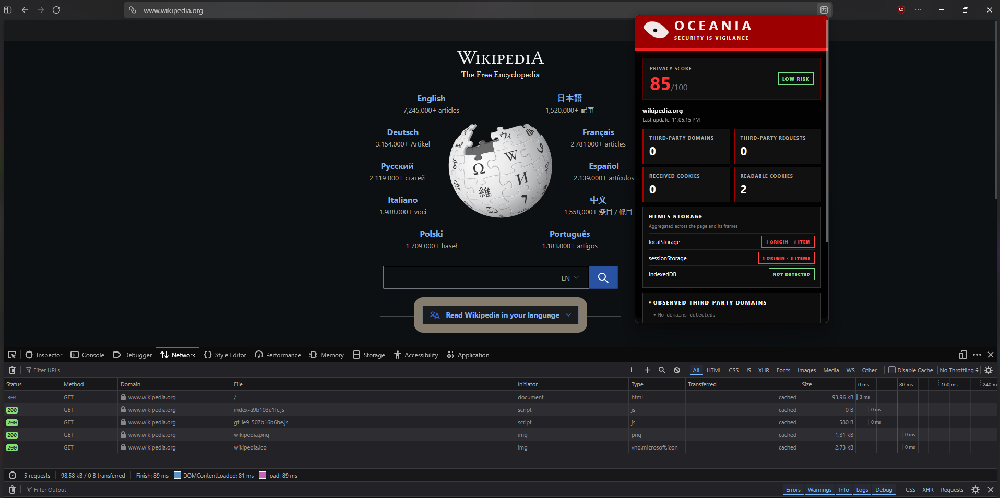
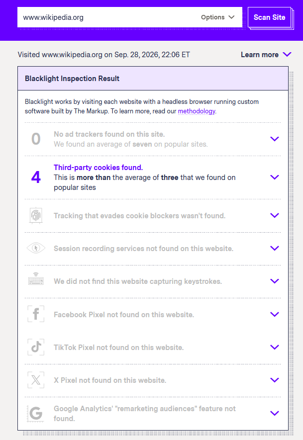
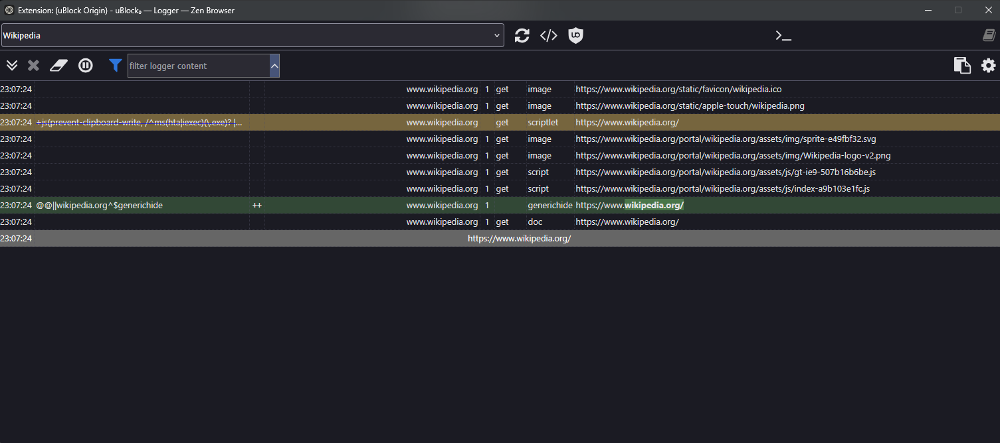
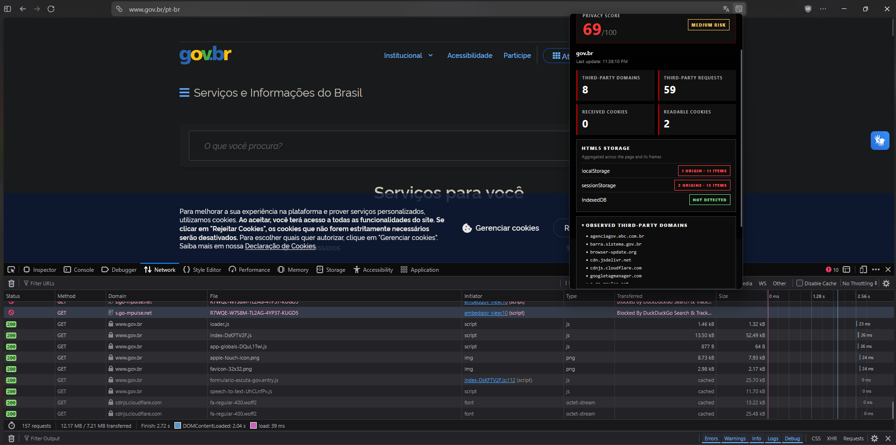
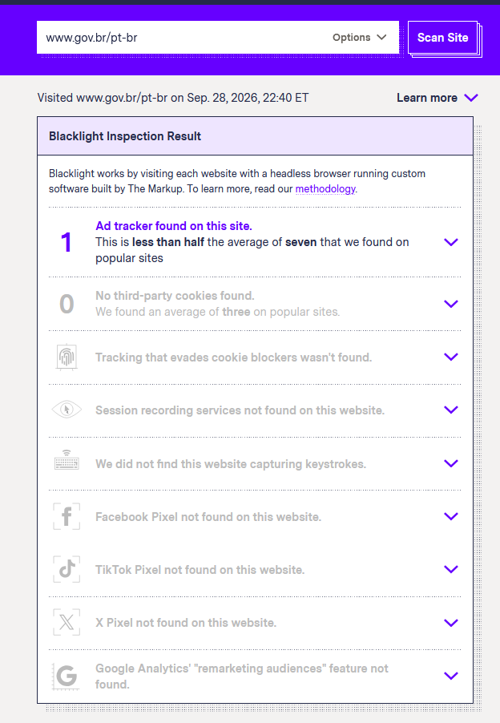
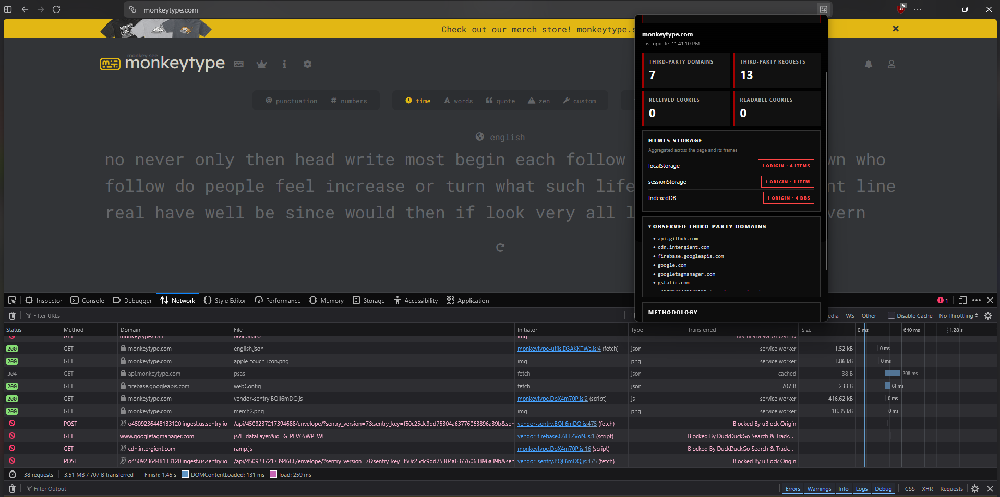
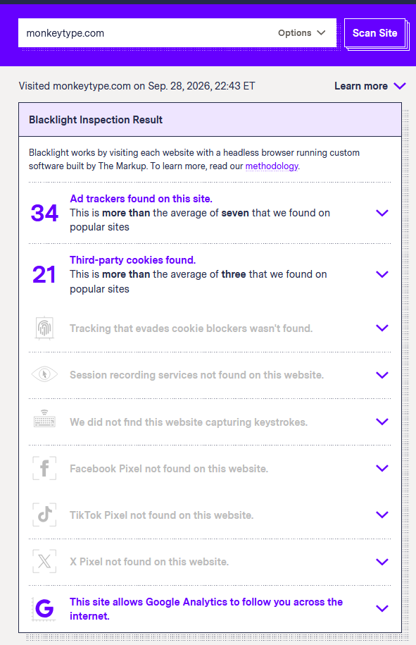

# Relatório de execução - Oceania

> Documento preenchido com as evidências coletadas em 28/09/2026. Antes da entrega, substituir os campos de identificação entre colchetes, repetir as medições no Firefox oficial e exportar a versão final para PDF.

## 1. Identificação e ambiente

- Aluno: [nome completo]
- Matrícula: [matrícula]
- Repositório: [URL do repositório]
- Extensão: Oceania 1.1.1, Manifest V3
- Sistema operacional: Windows
- Navegador registrado no HAR atual: Zen 1.22.3b
- Data das medições: 28/09/2026

**Pendência de conformidade:** o enunciado solicita execução no Firefox. O Zen é derivado do Firefox, mas não deve ser apresentado como se fosse o Firefox oficial. Antes da entrega, as medições finais e os arquivos HAR devem ser repetidos no Firefox e a versão exata deve ser registrada nesta seção.

## 2. Objetivo e funcionamento

O Oceania é uma extensão Manifest V3 que produz um relatório de privacidade para a aba atual. O script de background observa as requisições de rede, identifica domínios de terceira parte e conta cabeçalhos `Set-Cookie` recebidos. O content script verifica `localStorage`, `sessionStorage` e `IndexedDB` no documento principal e nos seus frames. O popup agrega os resultados por origem, evitando somar duas vezes frames que compartilham a mesma origem.

A classificação como terceira parte é feita comparando o domínio registrável da página principal com o domínio de cada requisição. Essa classificação indica separação de origem, mas não prova que o recurso seja um rastreador: CDNs, fontes, pagamentos e outros componentes funcionais também podem ser servidos por terceiros.

## 3. Metodologia da pontuação

Cada página começa com 100 pontos. O Oceania aplica os seguintes descontos:

| Sinal observado | Desconto | Limite | Justificativa |
| --- | ---: | ---: | --- |
| Domínio de terceira parte | 2 pontos por domínio | 40 | Mais terceiros ampliam as possibilidades de compartilhamento de dados. |
| Cookie recebido por `Set-Cookie` | 1 ponto por cabeçalho | 25 | Cookies podem manter identificadores entre requisições e acessos. |
| Uso de `localStorage` | 10 pontos | 10 | O armazenamento persistente pode manter identificadores no cliente. |
| Uso de `sessionStorage` | 5 pontos | 5 | Mantém estado durante a sessão, com persistência menor. |
| Uso de `IndexedDB` | 10 pontos | 10 | Permite armazenar estruturas e volumes de dados mais complexos. |

A fórmula utilizada é:

```text
score = max(0,
  100
  - min(40, 2 × domínios terceiros)
  - min(25, cookies recebidos)
  - 10 se localStorage for usado
  - 5 se sessionStorage for usado
  - 10 se IndexedDB for usado
)
```

Scores entre 80 e 100 são classificados como risco baixo; entre 50 e 79, risco médio; e abaixo de 50, risco alto. O score é um indicador comparativo baseado em sinais técnicos, não uma afirmação de que o site possui comportamento malicioso.

## 4. DuckDuckGo Privacy Test Pages

Os testes foram executados com o popup do Oceania aberto e o DevTools visível. A própria página de teste foi usada como fonte do resultado esperado.

| Teste | Resultado reportado pela página | Resultado do Oceania | Avaliação |
| --- | --- | --- | --- |
| Tracker Reporting | Um rastreador principal carregado por `script src`. | 1 domínio terceiro (`doubleclick.net`), 1 requisição terceira, 0 cookies recebidos e score 93. | O domínio foi detectado corretamente. A requisição apareceu como bloqueada pela proteção do navegador, mas ainda foi observada pelo `webRequest`. |
| Storage Blocking | Número aleatório armazenado usando 23 mecanismos; 1 mecanismo falhou. | 3 domínios terceiros, 23 requisições terceiras, 7 cookies recebidos, `localStorage` em 3 origens/3 itens, `sessionStorage` em 3 origens/6 itens, `IndexedDB` em 3 origens/3 bancos e score 62. | O Oceania detectou os três tipos de storage exigidos e agregou os frames por origem. O total de 23 da página inclui mecanismos fora do escopo do Conceito C. |
| Fingerprinting/Canvas | A página executou verificações de resistência e desempenho do canvas, apresentando resultados `pass` e `fail`. | 1 domínio terceiro (`cdnjs.cloudflare.com`), 1 requisição terceira, 0 cookies recebidos, uso dos três storages e score 73. | O Oceania não instrumenta as chamadas de Canvas; ele observou somente tráfego e storage associados. Essa limitação é esperada no escopo do Conceito C. |

### 4.1 Tracker Reporting

A página informou o carregamento de um rastreador conhecido por meio de `script src`. O Oceania encontrou uma requisição para `doubleclick.net`, domínio diferente de `first-party.site`, classificando-a como terceira parte. O painel de rede mostrou que a tentativa foi bloqueada pela proteção de rastreamento do navegador. Por isso, a extensão registrou a tentativa de conexão, mas nenhum cookie foi recebido.

O score foi conferido manualmente: 100 menos 2 pontos por um domínio terceiro e menos 5 pontos pelo uso de `sessionStorage`, resultando em 93.



### 4.2 Storage Blocking

A página conseguiu armazenar o número aleatório por 23 mecanismos, com uma falha. O Oceania identificou três origens usando `localStorage`, três usando `sessionStorage` e três instâncias de IndexedDB. Em `sessionStorage`, as três origens continham um total de seis itens. Isso não representa Cache Storage: o número corresponde à soma das chaves de `sessionStorage` observadas nas origens.

O painel Storage do navegador organiza os dados principalmente por origem e não apresenta necessariamente a mesma contagem do popup. Além disso, os 23 mecanismos da página incluem cookies, Cache API, CookieStore e outros recursos que o Oceania não contabiliza como `localStorage`, `sessionStorage` ou `IndexedDB`.

O score 62 também foi confirmado: 6 pontos por três domínios terceiros, 7 pelos cookies recebidos, 10 por `localStorage`, 5 por `sessionStorage` e 10 por IndexedDB. A dedução total foi 38.



### 4.3 Fingerprinting/Canvas

A página executou comparações dos pixels e medições de desempenho do canvas. Alguns testes de resistência falharam e os testes de desempenho apresentados passaram. O Oceania não afirma ter detectado canvas fingerprinting, pois a versão desenvolvida para o Conceito C não intercepta métodos como `getImageData()` ou `toDataURL()`.

A extensão detectou uma requisição para `cdnjs.cloudflare.com` e identificou uso dos três storages na origem principal. O resultado demonstra uma limitação importante: tráfego e armazenamento relacionados à página podem ser observados, mas isso não basta para atribuir tecnicamente a leitura do canvas a uma tentativa de fingerprinting.



## 5. Site real 1 - Wikipedia

### 5.1 Procedimento

Foi analisada a página `https://www.wikipedia.org/`. O log de rede foi preservado e exportado no formato HAR. Também foram registrados o popup do Oceania, o relatório do Blacklight e o logger do uBlock Origin.

### 5.2 Resultado do Oceania

O Oceania apresentou score 85, classificado como risco baixo. Não foram encontrados domínios nem requisições de terceira parte e nenhum cabeçalho `Set-Cookie` foi recebido durante a captura. A página possuía dois cookies legíveis por `document.cookie`, um item em `localStorage`, três itens em `sessionStorage` e nenhum IndexedDB detectado.

O cálculo foi: 100 menos 10 pontos por `localStorage` e menos 5 por `sessionStorage`, resultando em 85.



### 5.3 Análise do HAR

O arquivo HAR contém cinco requisições `GET`, todas para `www.wikipedia.org`: o documento principal, dois scripts, o ícone e uma imagem. Foram registrados quatro status 200 e um status 304. Não existe domínio de terceira parte no arquivo e nenhuma resposta contém `Set-Cookie`, confirmando as contagens de terceiros e cookies recebidos apresentadas pelo Oceania.

O HAR contém cinco nomes únicos de cookies enviados nas requisições: `GeoIP`, `NetworkProbeLimit`, `WMF-Last-Access`, `WMF-Last-Access-Global` e `WMF-Uniq`. Esses cookies já existiam antes da captura; portanto, não aparecem no contador de cookies recebidos, que mede somente novos cabeçalhos `Set-Cookie`. O popup conseguiu ler dois cookies pela API `document.cookie`. A diferença em relação aos cinco enviados na rede pode ser explicada por atributos como `HttpOnly`, domínio e caminho, que restringem a visibilidade para JavaScript.

Arquivo analisado: [`trafego.har`](../evidencias/sites-reais/site-1-wikipedia/trafego.har).

### 5.4 Resultado do Blacklight

O Blacklight não encontrou ad trackers, evasão de bloqueadores de cookies, gravação de sessão, captura de teclas, Facebook Pixel, TikTok Pixel, X Pixel ou audiência de remarketing do Google Analytics. Entretanto, relatou quatro cookies de terceira parte.

Esse resultado diverge da captura local: o HAR não contém requisições de terceira parte, enquanto o Blacklight executa a página em outro navegador automatizado e em outra sessão. Conteúdo condicional, localização, cookies preexistentes, proteção do navegador e diferenças no modo de interação podem produzir respostas distintas. Como os quatro cookies do Blacklight não aparecem no HAR local, não há evidência para atribuí-los ao mesmo carregamento observado pelo Oceania.



### 5.5 Resultado do uBlock Origin

O logger do uBlock registrou somente requisições para `www.wikipedia.org`. Não há linha de requisição de rede bloqueada nem domínio terceiro no registro apresentado. O logger mostra atividade de filtros cosméticos/scriptlets, incluindo uma exceção `generichide`, mas isso não representa o bloqueio de um rastreador de rede.

Nesse carregamento, o uBlock e o Oceania concordaram quanto à ausência de tráfego de terceiros. A concordância também é sustentada pelo HAR, que contém somente o domínio principal.



### 5.6 Reconciliação

| Fonte | Resultado principal | Concordâncias | Divergências e explicação |
| --- | --- | --- | --- |
| Oceania | 0 domínios terceiros; 0 cookies recebidos; score 85. | Concorda com HAR e uBlock sobre ausência de terceiros. | Leu 2 cookies por JavaScript, enquanto o HAR enviou 5 nomes de cookies já existentes. |
| HAR | 5 requisições, todas para `www.wikipedia.org`; 0 `Set-Cookie`. | Confirma os contadores de terceiros e cookies recebidos do Oceania. | Contém 5 cookies de requisição porque registra também cookies não visíveis por `document.cookie`. |
| Blacklight | 0 ad trackers; 4 cookies de terceira parte; demais categorias negativas. | Concorda que não foram encontrados ad trackers e outras técnicas invasivas listadas. | Os quatro cookies terceiros não aparecem no HAR local; a medição foi feita em outro ambiente automatizado. |
| uBlock Origin | 0 requisições de rede bloqueadas no logger apresentado. | Concorda com Oceania e HAR sobre ausência de tráfego terceiro. | Houve atividade de filtros cosméticos/scriptlets, que não equivale a bloqueio de rede. |

## 6. Site real 2 - gov.br

### 6.1 Resultado do Oceania

Foi analisada a página `https://www.gov.br/pt-br`. O Oceania apresentou score 69, classificado como risco médio. Foram observados oito domínios terceiros, 59 requisições de terceiros, nenhum cookie recebido, dois cookies legíveis, onze itens em `localStorage`, treze itens em `sessionStorage` distribuídos por duas origens e nenhum IndexedDB.

Os oito domínios terceiros visíveis no popup e confirmados no HAR foram `agenciagov.ebc.com.br`, `barra.sistema.gov.br`, `browser-update.org`, `cdn.jsdelivr.net`, `cdnjs.cloudflare.com`, `s.go-mpulse.net`, `vlibras.gov.br` e `www.googletagmanager.com`.

O score foi conferido: 100 menos 16 pontos por oito domínios terceiros, menos 10 por `localStorage` e menos 5 por `sessionStorage`, resultando em 69. Não houve desconto por cookies recebidos ou IndexedDB.



### 6.2 Análise do HAR

O HAR contém 149 requisições `GET`. Foram registradas 135 respostas 200, três redirecionamentos 302 e onze entradas com status 0, associado a requisições bloqueadas ou canceladas. Oito domínios terceiros nomeados totalizaram 57 entradas no HAR. O Oceania registrou 59 requisições terceiras, uma diferença de duas requisições.

Essa diferença é tecnicamente plausível porque o `webRequest` registra tentativas antes de algumas formas de bloqueio, enquanto o HAR representa o conjunto exportado pelo Network Monitor. Requisições dinâmicas, canceladas, repetidas ou realizadas durante momentos ligeiramente diferentes da captura podem aparecer em apenas uma das fontes.

Nenhuma resposta do HAR contém `Set-Cookie`, em concordância com o contador zero de cookies recebidos. Dois nomes de cookies preexistentes foram enviados nas requisições: `Encrypted-Local-Storage-Key` e `I18N_LANGUAGE`, coerentes com os dois cookies legíveis exibidos pelo popup.

Arquivo analisado: [`trafego.har`](../evidencias/sites-reais/site-2-govbr/trafego.har).

### 6.3 Resultado do Blacklight

O Blacklight encontrou um ad tracker e nenhum cookie de terceira parte. Também não encontrou evasão de bloqueadores de cookies, gravação de sessão, captura de teclas, pixels da Meta, TikTok ou X, nem audiência de remarketing do Google Analytics.

O resultado não contradiz os oito domínios terceiros do Oceania. O Oceania classifica todo domínio registrável diferente como terceira parte, incluindo CDNs, fontes e componentes de acessibilidade. O Blacklight aplica regras especializadas para decidir quais recursos constituem tecnologia de rastreamento e classificou apenas um deles como ad tracker.



### 6.4 Resultado do uBlock Origin

O logger fornecido contém onze eventos marcados como bloqueio, com repetições decorrentes de frames ou carregamentos. Os alvos únicos mais relevantes foram `browser-update.org`, `s.go-mpulse.net` e `www.googletagmanager.com`. O uBlock também redirecionou requisições do Google Tag Manager para um recurso substituto e aplicou scriptlets na origem `agenciagov.ebc.com.br`, incluindo a neutralização da função `executaGoogleAnalytics3`.

Esses registros explicam as onze entradas com status 0 no HAR e mostram que parte do tráfego de analytics observado pelo Oceania não chegou a produzir uma resposta normal.

Logger analisado: [`ublock-logger.md`](../evidencias/sites-reais/site-2-govbr/ublock-logger.md).

### 6.5 Reconciliação

| Fonte | Resultado principal | Concordâncias | Divergências e explicação |
| --- | --- | --- | --- |
| Oceania | 8 domínios terceiros; 59 requisições terceiras; 0 cookies recebidos; score 69. | Os oito domínios nomeados aparecem no HAR; o contador de cookies coincide. | Registrou duas tentativas terceiras a mais que o HAR, provavelmente por bloqueios, cancelamentos ou diferença no instante da captura. |
| HAR | 149 requisições; 8 domínios terceiros nomeados e 57 requisições terceiras; 0 `Set-Cookie`. | Confirma os domínios e a ausência de novos cookies. | Onze entradas possuem status 0 porque proteções estavam ativas. |
| Blacklight | 1 ad tracker; 0 cookies terceiros; demais categorias negativas. | Concorda que houve tecnologia publicitária limitada e nenhum cookie terceiro. | Não considera todo domínio terceiro um rastreador; CDNs e serviços funcionais ficam fora da categoria. |
| uBlock Origin | 11 eventos de bloqueio; 3 alvos únicos principais, além de redirects e scriptlets. | Identifica analytics entre os terceiros vistos pelo Oceania. | Sua finalidade é bloquear por listas de filtros, enquanto o Oceania apenas observa todos os terceiros. |

## 7. Site real 3 - Monkeytype

### 7.1 Resultado do Oceania

Foi analisada a página `https://monkeytype.com/`. O Oceania encontrou sete domínios terceiros e treze requisições de terceiros. Não houve cookie recebido nem cookie legível. Foram detectados quatro itens em `localStorage`, um item em `sessionStorage` e quatro bancos IndexedDB, todos associados à origem principal.

Pelos valores mostrados, o score é 61: 100 menos 14 pontos por sete domínios terceiros, menos 10 por `localStorage`, menos 5 por `sessionStorage` e menos 10 por IndexedDB. A área superior do score ficou parcialmente cortada no print, mas os componentes visíveis permitem reproduzir o cálculo.

Os sete terceiros confirmados pelo HAR foram `api.github.com`, `cdn.intergient.com`, `firebase.googleapis.com`, `o4509236448133120.ingest.us.sentry.io`, `www.google.com`, `www.googletagmanager.com` e `www.gstatic.com`. `api.monkeytype.com` foi tratado como first-party por compartilhar o domínio registrável `monkeytype.com`.



### 7.2 Análise do HAR

O HAR contém 38 entradas: 35 requisições `GET` e três `POST`. Foram registradas 30 respostas 200, duas respostas 304 e seis entradas com status 0. Os sete domínios terceiros nomeados totalizaram nove requisições no arquivo, enquanto o Oceania registrou treze tentativas terceiras.

As quatro tentativas adicionais podem decorrer do momento em que o `webRequest` e o Network Monitor registram uma requisição, de repetições feitas por service worker e de recursos bloqueados antes de aparecerem de forma equivalente no HAR. As entradas com status 0 incluem três envios ao Sentry e requisições ao Google Tag Manager e Intergient, exatamente os alvos presentes no logger do uBlock.

Não há resposta `Set-Cookie`, confirmando o zero mostrado pelo Oceania. O HAR contém o cookie preexistente `cf_clearance` enviado ao domínio principal, mas o popup apresentou zero cookies legíveis. A diferença pode ser explicada pelos atributos do cookie, especialmente `HttpOnly`, que impede acesso por `document.cookie`.

Arquivo analisado: [`trafego.har`](../evidencias/sites-reais/site-3-monkeytype/trafego.har).

### 7.3 Resultado do Blacklight

O Blacklight apresentou um cenário muito mais agressivo: 34 ad trackers, 21 cookies de terceira parte e permissão para o Google Analytics acompanhar o usuário entre sites. Não encontrou evasão de bloqueadores de cookies, gravação de sessão, captura de teclas nem pixels da Meta, TikTok ou X.

A diferença em relação ao HAR local é explicada principalmente pelo ambiente. Na captura local, uBlock Origin e a proteção de rastreamento do navegador estavam ativos; o painel de rede mostra recursos bloqueados. Já o Blacklight executou o site em sua própria sessão automatizada e conseguiu exercitar uma quantidade maior da infraestrutura publicitária. Consequentemente, o Blacklight observou cookies e trackers que foram impedidos de carregar na sessão local.



### 7.4 Resultado do uBlock Origin

O logger contém cinco eventos de bloqueio distribuídos por três alvos únicos: o script publicitário `cdn.intergient.com`, o Google Tag Manager e o endpoint de telemetria do Sentry. Também houve redirecionamento do Google Tag Manager para um recurso substituto local e aplicação de um filtro cosmético `##.ad`.

Os bloqueios coincidem com domínios encontrados pelo Oceania e com as entradas de status 0 no HAR. Eles também ajudam a explicar por que o Blacklight encontrou muito mais publicidade e cookies do que a captura local protegida.

Logger analisado: [`ublock-logger.md`](../evidencias/sites-reais/site-3-monkeytype/ublock-logger.md).

### 7.5 Reconciliação

| Fonte | Resultado principal | Concordâncias | Divergências e explicação |
| --- | --- | --- | --- |
| Oceania | 7 domínios terceiros; 13 requisições terceiras; 0 cookies recebidos; score calculado 61. | Os sete domínios nomeados aparecem no HAR; Intergient, GTM e Sentry aparecem também no uBlock. | Registrou quatro tentativas terceiras a mais do que o HAR exportado. |
| HAR | 38 entradas; 7 domínios terceiros nomeados e 9 requisições terceiras; 0 `Set-Cookie`. | Confirma os domínios e a ausência de cookies novos. | Seis entradas possuem status 0; recursos bloqueados não refletem a execução completa vista pelo Blacklight. |
| Blacklight | 34 ad trackers; 21 cookies terceiros; Google Analytics cross-site. | Confirma forte presença de infraestrutura publicitária e analytics. | Observou um ambiente sem os mesmos bloqueios da captura local. |
| uBlock Origin | 5 eventos de bloqueio; 3 alvos únicos principais. | Bloqueou terceiros também detectados pelo Oceania e presentes no HAR. | Reduziu o tráfego e os cookies disponíveis para a medição local. |

## 8. Comparação final dos três sites

| Site | Score Oceania | Blacklight | uBlock Origin | Síntese |
| --- | ---: | --- | --- | --- |
| Wikipedia | 85 | 0 ad trackers; 4 cookies terceiros | 0 bloqueios de rede observados | Baixo tráfego e apenas armazenamento first-party no teste local. |
| gov.br | 69 | 1 ad tracker; 0 cookies terceiros | 11 eventos; 3 alvos únicos principais | Vários terceiros funcionais e alguns recursos de analytics bloqueados. |
| Monkeytype | 61 | 34 ad trackers; 21 cookies terceiros; Google Analytics cross-site | 5 eventos; 3 alvos únicos principais | Maior exposição potencial; a proteção local bloqueou parte relevante da publicidade e telemetria. |

Os scores do Oceania ordenaram Wikipedia, gov.br e Monkeytype do menor para o maior risco observado, em concordância geral com o Blacklight quanto à baixa presença de ad trackers na Wikipedia e à maior exposição no Monkeytype. A comparação não é uma equivalência numérica: o Oceania penaliza todos os domínios terceiros e o uso de storage, enquanto o Blacklight procura assinaturas e comportamentos específicos de rastreamento.

## 9. Limitações

- O contador de cookies recebidos considera cabeçalhos `Set-Cookie` observados depois que a extensão iniciou a captura; cookies preexistentes não entram nesse contador.
- `document.cookie` não expõe cookies marcados como `HttpOnly`.
- A classificação por domínio terceiro não determina, sozinha, que o recurso seja um rastreador.
- O protótipo não intercepta APIs de Canvas e, portanto, não detecta diretamente canvas fingerprinting.
- A identificação do domínio registrável usa uma lista reduzida de sufixos comuns, não uma Public Suffix List completa.
- O Blacklight executa o site em um ambiente diferente, de modo que seus resultados não precisam reproduzir exatamente o HAR local.
- As capturas locais de gov.br e Monkeytype foram realizadas com mecanismos de bloqueio ativos. Por isso, elas mostram tentativas detectadas e recursos bloqueados, não um carregamento sem proteção.
- As evidências atuais foram capturadas no Zen 1.22.3b e devem ser repetidas no Firefox para atendimento literal ao enunciado.

## 10. Conclusão

Os testes padronizados demonstraram que o Oceania identifica requisições de terceira parte, cookies recebidos e uso dos três mecanismos de armazenamento exigidos para o Conceito C. O teste de Tracker Reporting confirmou a observação de uma tentativa de contato com um rastreador; o teste de Storage Blocking confirmou a medição de `localStorage`, `sessionStorage` e IndexedDB em múltiplas origens; e o teste de Canvas tornou explícita a limitação de não instrumentar diretamente a API de desenho.

Nos sites reais, a Wikipedia apresentou a menor exposição local, com score 85 e somente tráfego first-party. O gov.br obteve 69 devido a oito domínios terceiros e dois mecanismos de storage, embora o Blacklight tenha classificado apenas um ad tracker. O Monkeytype obteve o menor score, 61, e apresentou forte divergência entre a captura local protegida e o Blacklight, que encontrou 34 ad trackers e 21 cookies de terceira parte.

As comparações demonstram que as ferramentas possuem objetivos diferentes. O Oceania oferece visibilidade ampla sobre terceiros, cookies e storage; o Blacklight classifica técnicas específicas; o uBlock impede recursos conforme listas de filtros; e o HAR fornece a evidência detalhada do tráfego efetivamente registrado. O uso conjunto dessas fontes permitiu explicar as divergências com base em domínios, status das requisições e mecanismos de bloqueio, em vez de atribuí-las genericamente a diferenças entre ferramentas.
